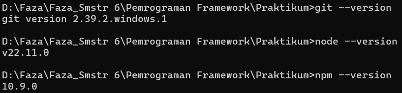

# Laporan Praktikum Jobsheet 1 - Pemrograman Berbasis Framework

## Identitas Mahasiswa
**Nama:** Ahmad Faza Alfan Fashlah  
**Kelas:** TI - 3D  
**NIM:** 2241720186  
**Program Studi:** D4 Teknik Informatika 

---

## Praktikum 1 - Menyiapkan Lingkungan Pengembangan
### Pertanyaan Praktikum 1

### Jawaban
1. * Git berguna untuk mengelola versi kode dan mempermudah kerja tim. 
   * VS Code adalah editor kode yang ringan dan praktis.
   * NodeJS dipakai untuk menjalankan JavaScript di luar browser, biasanya untuk backend. 
2. Hasil screenshot 

## Praktikum 2 - Membuat Proyek Pertama React Menggunakan Next.js
 

### Pertanyaan Praktikum 2

### Jawaban
1. * TypeScript => bahasa pemrograman yang dikembangkan di atas JavaScript dengan fitur tipe data statis, membuat kode lebih terstruktur dan minim bug
   * ESLint => alat untuk mendeteksi dan memperbaiki kesalahan atau inkonsistensi dalam kode JavaScript atau TypeScript. 
   * Tailwind CSS => framework CSS yang menyediakan utility classes siap pakai sehingga styling lebih cepat dan efisien. 
   * App Router => sistem routing baru di Next.js yang lebih fleksibel dan mendukung fitur server components.
   * Import alias => cara mempersingkat path import di project agar kode lebih rapi dan mudah dibaca. 
   * Turbopack => bundler generasi baru di Next.js yang lebih cepat dibanding Webpack, membuat proses build dan hot reload jadi jauh lebih responsif.

2. * folder app/: Tempat utama untuk membuat halaman dan komponen aplikasi dengan sistem routing bawaan Next.js.
   * folder public/: Menyimpan aset statis seperti gambar, ikon, atau file lainnya yang bisa diakses langsung lewat URL.
   * folder styles/: Berisi file CSS untuk mengatur tampilan aplikasi.
   * file .gitignore: Menentukan file atau folder yang diabaikan Git saat commit.
   * file next.config.js: Mengatur konfigurasi Next.js, seperti pengaturan build atau optimasi.
   * file package.json: Berisi informasi proyek dan daftar dependensi (library) yang digunakan.
   * file README.md: Dokumentasi dasar proyek.
   * folder node_modules/: Tempat semua library yang terinstal via npm atau yarn.

3. Hasil screenshots   

## Praktikum 3 - Menambahkan Komponen React(Button)
### Pertanyaan Praktikum 3
 

### Jawaban
1. Hasil screenshot  

## Praktikum 4 - Menulis Markup dengan JSX
### Pertanyaan Praktikum 4

### Jawaban
1. Sintaks user.imageUrl digunakan untuk mengambil URL gambar dari objek user, lalu menampilkannya di elemen img.
2. Hasil screenshot  

