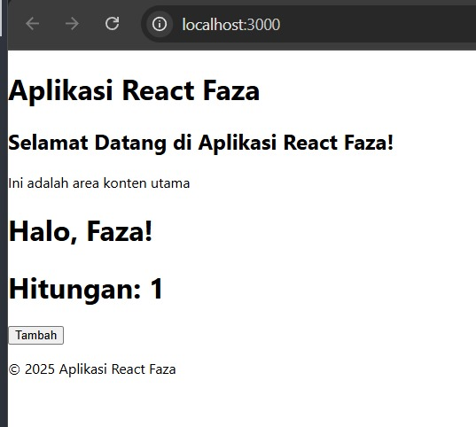

# Laporan Praktikum Jobsheet 2 - Pemrograman Berbasis Framework

## Identitas Mahasiswa
**Nama:** Ahmad Faza Alfan Fashlah  
**Kelas:** TI - 3D  
**NIM:** 2241720186  
**Program Studi:** D4 Teknik Informatika 

---

## Langkah - Langkah Praktikum
### **1. Persiapkan Lingkungan** 
 

### **2. Membuat Komponen React**  
  

### **3. Menggunakan JSX untuk Membuat Komponen Dinamis**  
  
    
### **4. Menggunakan Props untuk Mengirim Data**  
  

### **5. Membuat Komponen React Menggunakan State untuk Mengelola Data**  
  

## Tugas
### Penambahan Task pada TodoList
  

### Penghapusan Task pada TodoList
  

